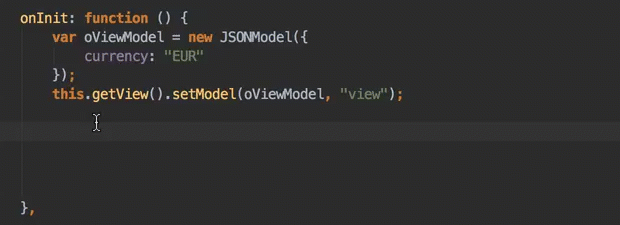
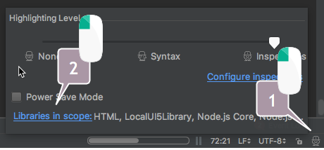
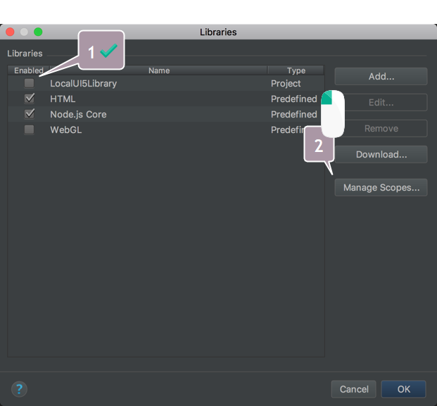

# UI5 codecompletion

[](https://travis-ci.org/vobujs/ui5-codecompletion)

`ui5-codecompletion` is a npm module providing a CLI that enables code completion in WebStorm's JS editor for a 
specific version of [(open)UI5](https://openui5.org). 



## Installation
    npm install -g ui5-codecompletion
    
## Usage
    $~ > ui5-codecompletion -h
    Usage: ui5-codecompletion <command> [options]
    
    Commands:
      configure [sourceDir]  uses the extracted UI5 library in $project/
      install [from] [to]    downloads (if URL) or copies (if fs path) and
                             configures a UI5 runtime library for code completion
    
    Options:
      -h, --help       Show help                                           [boolean]
      -f, --from       URL or file system path to zip-file w/ UI5 runtime sources,
                       defaults to
                       "https://openui5.hana.ondemand.com/downloads/openui5-runtime-
                       1.44.19.zip"
      -t, --to         file system path, relative to $project_dir, to store UI5
                       sources in; defaults to "$project/.ui5"
      -s, --sourceDir  file system path, relative to $project_dir, to configure code
                       completion with; defaults to "$project/.ui5"
    
    Examples:
      ui5-codecompletion install                downloads and configures UI5 with
                                                default options
      ui5-codecompletion install                installs UI5 from the specified URL
      --from=https://url/openui5-runtime.zip    to $project/.ui5
      ui5-codecompletion install \              installs UI5 from the URL pointing
      > -f=https://url/openui5-runtime.zip \    to the .zip, to
      > -t=ui5/sources/local                    $project/ui5/sources/local
      ui5-codecompletion configure              uses UI5 sources in
                                                $project/.ui5 to configure code
                                                completion
      ui5-codecompletion configure              uses UI5 sources in
      --sourceDir=my/relative/dir/ui5           $project/my/relative/dir/ui5 to
                                                configure code completion
      ui5-codecompletion configure -s=dir/ui5   uses UI5 sources in
                                                $project_dir/dir/ui5 to configure
                                                code completion


### download, install and configure UI5 LTS version
```
$~/your/app> ui5-codecompletion install
```
for downloading the most recent long term support runtime version of UI5,   
storing it in `.ui5` of your project and    
preparing those sources for code completion.   
(other options available, see above)

Then, tell WebStorm to use the library in your project.  
(***this configuration is necessary, but only once***)   
Open "Libraries in Scope" dialog:   
   

Check "LocalUI5Library" and "Manage Scopes":   
   

Select/Add the directory of your project code completion should apply to 
via selecting "LocalUI5Library" in "Library" drop-down:   


### download a custom version to a custom location and install and configure it for code completion
```
$~/your/app> ui5-codecompletion install --from=https://example.org/ui5.zip --to=local/lib
```
for downloading your custom UI5 version to `~/your/app/local/lib` and use these sources for code completion.      
(see above one-time config instructions if running `ui5-codecompletion` for the first time)

### configure existing UI5 lib for use with code completion
```
$~/your/other/app> ui5-codecompletion configure --sourcedir=extracted/UI5/sources
```
will look for a `resources` folder in `~/your/other/app/extracted/UI5/sources` and use 
all `*.dbg.js` UI5 files in there for code completion.   
(see above one-time config instructions if running `ui5-codecompletion` for the first time)

## Related
- [UI5 Schemas](https://github.com/ui5experts/ui5-schemas/)  
  for code completion in XML views in WebStorm
- [UI5 helper](https://plugins.jetbrains.com/plugin/9427-ui5-helper)   
  for some comfort navigating inside sources of a UI5 app in WebStorm

## FAQ
### Why [openUI5](https://openui5.org) only and not [SAPUI5](https://sapui5.hana.ondemand.com/) as well?
Because downloading [SAPUI5](https://sapui5.hana.ondemand.com/) requires checking of a disclaimer in the UI and
we were too lazy to script that. PR welcome!
### Why WebStorm only?
That's the editor we're using. Feel free to port to yours. PR welcome!